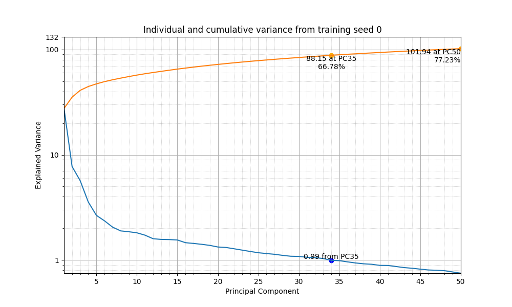
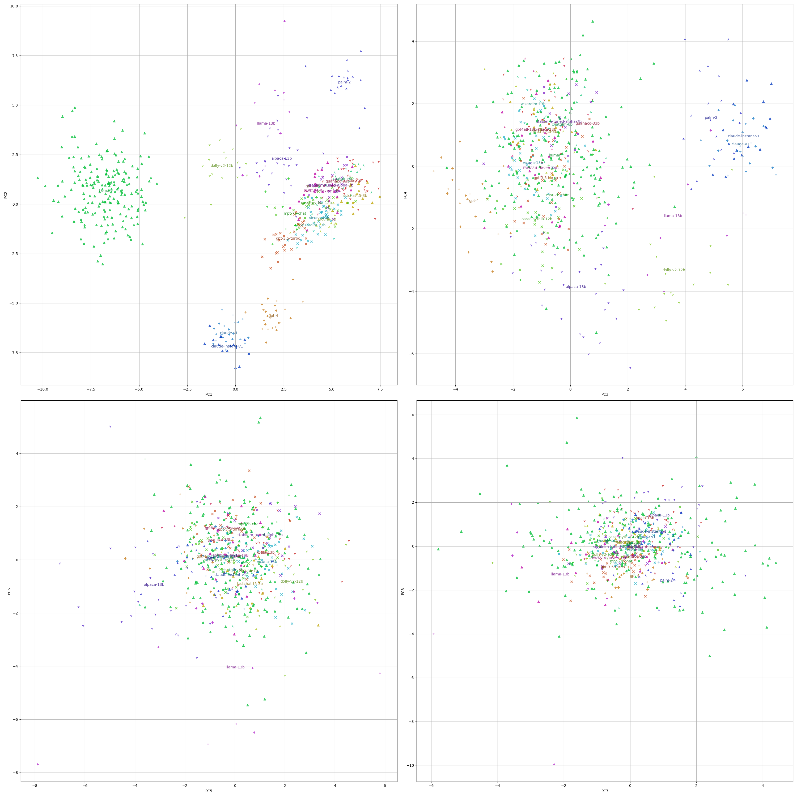
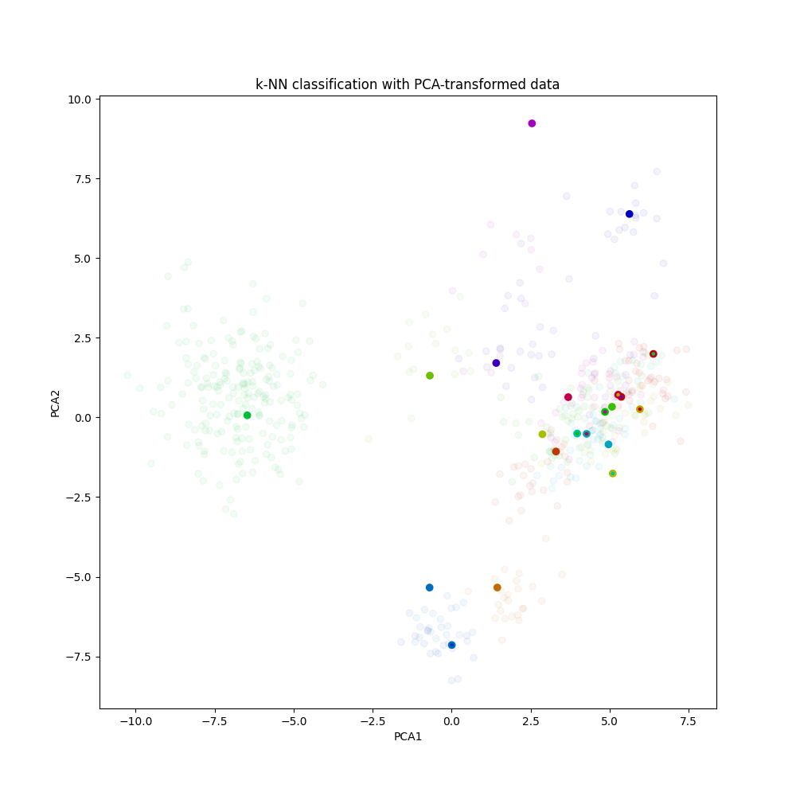
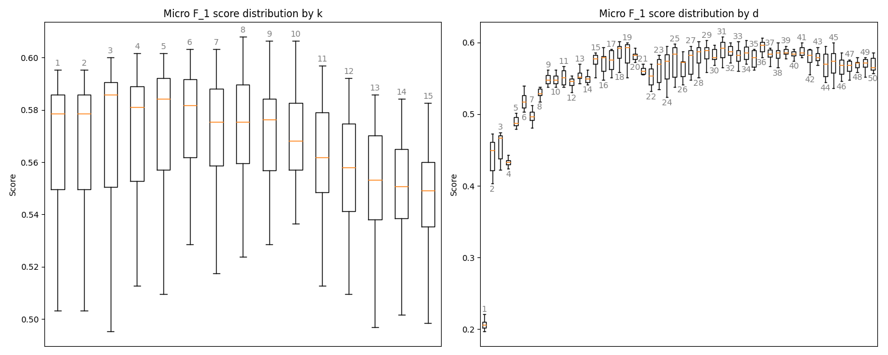

# slop-radar: An attempt in identifying human and AI-generated texts

## 1. Abstract
This project aims to distinguish between human and AI-generated texts on the basis of writing style, and provide insights on how to detect AI-generated text as a reader. Texts from a dataset of conversations between humans and various Large Language Models were converted into token frequency vectors. A combination of principal component analysis and k-nearest neighbours on these vectors was able to achieve 60.8% accuracy with optimal parameters (`d=31`, `k=8`), whereas human texts were identified with 96.8% accuracy. However, models with less representation in the dataset were predicted with lower accuracy. The findings show that word frequency alone, as a proxy for writing style, is able to detect AI-generated texts, and have the potential to further identify specific LLM authors. Further, the project identified areas of improvement, like addressing biases and the disproportional representation in the dataset.
## 2. Introduction
When OpenAI released [ChatGPT](https://openai.com/index/chatgpt/) in November of 2022, it disrupted multiple industries and many professionals considered the ways they could use it to improve their productivity. Unfortunately,  instead of viewing it as just another tool, many users have taken this to mean replacing entire tasks, like writing emails or drafting documents from scratch. Our current state-of-the-art *Large Language Models* suffer from a high rate of mistakes and an inability to fact check. People find their messages distant and impersonal as they lack the context that a human would have. LLMs have seen widespread use in an academic setting, and have had an equally widespread pushback as a form of academic dishonesty. Traditional plagiarism-checking services like Turnitin have even started to offer [detection of AI-written work](https://www.turnitin.com/blog/the-launch-of-turnitins-ai-writing-detector-and-the-road-ahead). Their ability to write in a convincing and authoritative manner with minimal effort has greatly simplified the creation of disinformation campaigns and scams [(Kumarage et al, 2024)](#^1).

Just as literacy has become necessary for all after the industrial age, I believe that digital literacy is necessary for all to stay safe in the near future. I consider myself an early adopter as I started to [download and run such models](https://huggingface.co/cognitivecomputations/WizardLM-33B-V1.0-Uncensored) off my own computer in July of 2023. [Enthusiasts in the LLM space](https://www.reddit.com/r/LocalLLaMA/comments/17xwuno/what_do_you_think_about_gptisms_polluting/) who have seen enough generated text know their shortcomings more intimately and have developed a better sense of whether any text is written by a human. They try to identify what they call *GPT-isms* or *slop*: choice phrases and figures of speech that are stereotypical of ChatGPT or other models, which can be useful for a layperson to detect AI-generated text themselves.

Literature exists that focus on the effectiveness of detection [(Prova, 2024)](^#2), but they do not seem to draw conclusions that the general public can follow, and it may be impractical to rely on detection algorithms at all times. Therefore, in this project I prepare and analyse a corpus of texts written by a roster of models, and aim to identify choice vocabulary that distinguishes between human and AI-generated texts. I also implement and evaluate the abilities of the *k-nearest neighbours* algorithm to identify the exact author of any text. Finally, I conclude with some actionable steps to identify AI-generated text.
## 3. Background
In this section, I describe the building blocks of the project: the dataset and the algorithms that were used.
### 3.1. Dataset
[*Chatbot Arena*](https://chat.lmsys.org/) is an online platform that hosts multiple LLMs. When a user starts a conversation, the platform automatically chooses two of its models to provide responses. The user may continue the conversation with both anonymous models until they are ready to decide on the better model. In addition to developing Chatbot Arena, the team also released a paper that evaluated the strengths of their models over an 8-month period, as well as a curated dataset of conversations on the platform [(Chiang et al, 2024)](#^3).

Provided that you have accepted the dataset's terms of service on Hugging Face (which you can do by [following the link](https://huggingface.co/datasets/lmsys/chatbot_arena_conversations)), the dataset can be downloaded and used immediately in my accompanying notebook, by entering an access token associated with your Hugging Face account when prompted.

|     | question_id                      | model_a    | model_b    | winner  | judge          | conversation_a                                    | conversation_b                                    | turn | anony | language | tstamp       | openai_moderation                                 | toxic_chat_tag                                    |
| --- | -------------------------------- | ---------- | ---------- | ------- | -------------- | ------------------------------------------------- | ------------------------------------------------- | ---- | ----- | -------- | ------------ | ------------------------------------------------- | ------------------------------------------------- |
| 33  | 8120899314f74641b09c2aa114d4d253 | alpaca-13b | vicuna-13b | model_b | arena_user_316 | [{'content': 'Salut ! Comment ça va ce matin ?... | [{'content': 'Salut ! Comment ça va ce matin ?... | 6    | True  | French   | 1.682354e+09 | {'categories': {'harassment': False, 'harassme... | {'roberta-large': {'flagged': False, 'probabil... |

This is a typical row in the dataset. Every entry describes the metadata of a conversation between a user and two models not known to the user. The actual conversation has to be unpacked from `conversation_a` and `conversation_b`.

```
[{'content': 'Salut ! Comment ça va ce matin ?', 'role': 'user'},
 {'content': 'Ça va bien, merci. Et toi ?', 'role': 'assistant'},
 {'content': 'Ça va et toi ?', 'role': 'user'},
 {'content': 'Oui, et toi ?', 'role': 'assistant'},
 {'content': 'Ça va et vous ?', 'role': 'user'},
 {'content': 'Oui, et vous ?', 'role': 'assistant'},
 {'content': 'ça va', 'role': 'user'},
 {'content': 'ça va', 'role': 'assistant'},
 {'content': 'non ça va', 'role': 'user'},
 {'content': 'non ça va', 'role': 'assistant'},
 {'content': 'Ok ', 'role': 'user'},
 {'content': 'Ok', 'role': 'assistant'}]
```

This particular `conversation_a` shows that the user and the two models shared 6 messages each throughout their conversation. Messages with the `role` of `assistant` were written by `model_a`, which in this case was *alpaca-13b*.

```
[{'content': 'Salut ! Comment ça va ce matin ?', 'role': 'user'},
 {'content': "Salut ! Je vais bien, merci. Comment allez-vous aujourd'hui ?",
  'role': 'assistant'},
 {'content': 'Ça va et toi ?', 'role': 'user'},
 {'content': 'Oui, je vais bien également. Comment ça se passe pour vous ?',
  'role': 'assistant'},
 {'content': 'Ça va et vous ?', 'role': 'user'},
 {'content': "Oui, je vais bien merci. Comment ça se passe pour vous aujourd'hui ?",
  'role': 'assistant'},
 {'content': 'ça va', 'role': 'user'},
 {'content': "C'est super. Y a-t-il quelque chose que je puisse faire pour vous aider aujourd'hui ?",
  'role': 'assistant'},
 {'content': 'non ça va', 'role': 'user'},
 {'content': "Très bien, si vous avez besoin de quelque chose, n'hésitez pas à me demander. Je suis là pour vous aider.",
  'role': 'assistant'},
 {'content': 'Ok ', 'role': 'user'},
 {'content': "Très bien. N'hésitez pas à me contacter si vous avez besoin de quelque chose. Je suis toujours là pour vous aider.",
  'role': 'assistant'}]
```

Messages with the `role` of `assistant` in `conversation_b` were written by `model_b`, which in this case was *vicuna-13b*. Here, we can also see that messages with the `role` of `user` are identical across both conversations. They were written by the `judge`, *arena_user_316*, which is an anonymised identifier that Chatbot Arena has given the user. From the platform's perspective, users are differentiated by their IP addresses, but since IP addresses and devices can be shared, it is not given that messages from the same user are written by the same person.

The other fields are helpful in the event that the dataset is used to rank models against each other (using `winner`) or train a classifier to differentiate other attributes (`language`, `openai_moderation`, or `toxic_chat_tag`). However, for the purpose of identifying trends in model vocabulary, these fields have no use and I shall not describe them here.
### 3.2. Algorithms
Here, I give an overview of the algorithms that were used, as well as the context in which I used them.
#### 3.2.1. [`sklearn.feature_extraction.text.CountVectorizer.fit_transform()`](https://scikit-learn.org/stable/modules/generated/sklearn.feature_extraction.text.CountVectorizer.html#sklearn.feature_extraction.text.CountVectorizer.fit_transform) from `scikit-learn`
By passing in a corpus of texts, this algorithm provides vectors of *token* counts for each text, where each token roughly corresponds to a word. With default parameters, it derives a list of tokens by separating texts at spaces, and removes duplicates and predetermined stop words like "the" and "a" from the list. The resulting list is the *vocabulary*, which is a list of all unique tokens that appear at least once across the corpus. Then, for each text, the algorithm counts the number of times each token in the vocabulary appears. It returns a two-dimensional array of text indices on one side and the list of tokens on the other.

For a large enough corpus, this usually results in a sparse matrix, as most tokens in the vocabulary don't appear at least once in any given text, resulting in many zeroes. This algorithm is used in the notebook to provide a count of word frequency per text in the dataset, as numerical features are more readily learned than raw text.
#### 3.2.2. Principal Component Analysis
Given a set of points, this algorithm finds a new coordinate system where the first few axes (principal components) capture the directions of maximum variance. In other words, if the points are projected into this system and some dimensions further back are dropped, much of the relationship between the points (variance) is maintained.

The process of finding principal components is iterative and an intuitive method is often taught, where a line is fit through the centre, so that the perpendicular distance between the points and the line is minimised. *Gradient descent* with an appropriate learning rate (alpha) can gradually align the line in the right direction. However, this fitting can be replaced by *eigenvalue algorithms*. By finding the *covariance matrix* (the relationship between each and every other point under a constant change), I can find its *eigenvector* using *power iteration*, which I shall explain below.

PCA makes further processing easier, especially for other algorithms whose time and memory footprint disproportionately increases with more dimensions. However, a reduced principal component space loses some of the variance. Therefore, it is useful to have a *hyperparameter* that determines how many principal components we would like to keep. Higher values result in more retained components, making the approximation of the points more accurate but nullifying the dimensionality reduction advantage of PCA. Meanwhile, lower values speed up processing but risk discarding relevant patterns.

In this project, where the points represent batches of texts from each author, I use PCA to reduce the dimensionality of token frequency vectors while retaining the relationships that can help indicate authorship (variance). This accelerates further operations such as k-nearest neighbours. Additionally, the first few principal components also surface the most important tokens when discriminating between authors.
#### 3.2.3. Power iteration
By passing in a matrix, this algorithm provides its *dominant eigenvalue* and corresponding *eigenvector*. In my implementation, it starts with a random vector, multiplies that vector by the matrix and normalises the result. Provided that the starting vector isn't orthogonal to the eigenvector, it will stretch/squeeze to be more and more like the eigenvector. I repeat this multiplication repeatedly until the vector changes too little to matter — convergence. I define an error tolerance, below which the iteration ends.

The goal of each step in PCA is to find the next direction with the largest spread of values. In that context, the eigenvector of the covariance matrix is equivalent to that direction, and the eigenvalue to the explained variance. There are many other eigenvalue algorithms, but power iteration was the easiest for me to wrap my head around. It is also memory-efficient, which is ideal for the memory footprint of sparse matrices. This simplicity comes as a trade-off to its slow convergence compared to more advanced algorithms like the *QR decomposition*.
#### 3.2.4. k-nearest neighbours
The definition is in its name: it plots an unlabelled testing point against a labelled set of *training* points, and predicts a label based on a plurality of `k` of its nearest neighbours. Since a training set with labels has to already be provided, this makes k-NN the only supervised learning algorithm in this section.

Due to its simplicity many variations exist, and the available hyperparameters can vary by implementation. For example, "near" can depend on the [distance metric](https://uhurasolutions.com/2020/07/15/a-short-introduction-to-k-nearest-neighbor-or-simply-k-nn/) being used. Commonly, the Euclidean distance is used with numerical and continuous values, although different methods may yield better results (such as Hamming/Levenshtein distance for text or Manhattan distance for discrete values). One could even implement multiple metrics to find the best. In the case of ties, the labels of closer neighbours can be weighted more, or the test point can be resampled with the original neighbours removed: *bootstrapping*.

In my implementation, I've decided to keep it simple, Euclidean distance being the distance metric and a decreasing `k` for tiebreaks. This results in one hyperparameter: `k`. Larger values capture trends in the big picture but may perform poorly for label clusters that are close to each other. Lower values may provide that precision but may risk overfitting to outlier training points. In this project, k-NN is used to predict the author of a batch of text projected on a reduced PC space. It helps measure the extent to which the first few PCs can differentiate between human and AI-generated texts.
## 4. Methodology
I describe the methods of preparing and analysing the dataset, so that the notebook is better understood. Should further reproducibility be desired, I have made the notebook as self-contained and streamlined as possible, so that it all cells can be executed in one click with no dependencies and no unpacking of data.
### 4.1. Preparing the dataset
In this section, I describe how I transformed multiple messages from each row of the dataset into a structured format, suitable for analysis.
#### 4.1.1. Extracting text-author pairs
From each row in the dataset I identified the following 3 kinds of texts:
- Messages from `model_a`, found by filtering entries in `conversation_a` where the `role` is `assistant`.
- Messages from `model_b`, found by filtering entries in `conversation_b` where the `role` is `assistant`. Since both models respond alternately to the same prompts, the number of messages here matches the number of messages from `model_a`.
- Messages from a human, found by filtering entries in either conversation where the `role` is `user`. The author would be the blanket term "human".

I considered further differentiating human texts by their `judge` identifiers (e.g., `arena_user_316`). However, apart from a few power users there weren't enough text from each author to form a single batch of 200 texts. Normalising a smaller batch means that any token that exists is overrepresented. Additionally, as discussed above, there is no guarantee that the same user consistently represents a single human.

```
vicuna-13b: 7193
koala-13b: 6615
oasst-pythia-12b: 5774
gpt-3.5-turbo: 5573
alpaca-13b: 5399
gpt-4: 4945
claude-v1: 4500
RWKV-4-Raven-14B: 4392
chatglm-6b: 3791
fastchat-t5-3b: 3699
vicuna-7b: 3578
palm-2: 3527
mpt-7b-chat: 3516
dolly-v2-12b: 3307
stablelm-tuned-alpha-7b: 3249
claude-instant-v1: 3117
llama-13b: 2393
gpt4all-13b-snoozy: 1425
wizardlm-13b: 1391
guanaco-33b: 1248
arena_user_15085: 458
arena_user_9965: 434
arena_user_13046: 385
arena_user_257: 296
arena_user_11473: 240
arena_user_3820: 213
arena_user_9676: 166
52 authors who have between 50 and 138 texts.
91 authors who have between 25 and 49 texts.
172 authors who have between 15 and 24 texts.
252 authors who have between 10 and 14 texts.
619 authors who have between 6 and 9 texts.
1877 authors who have between 3 and 5 texts.
10313 authors who have between 1 and 2 texts.
```

Instead, I rolled all 39316 human texts into a single author: "human". To reduce the variance between batches and better approximate the average writing style of this human and each model, I shuffled all extracted text-author pairs before batching. As the messages in each conversation were spread across the batches, words that are common only in niche topics were also homogenised.
#### 4.1.2. Creating token count vectors for each text
As discussed earlier, I used `CountVectorizer.fit_transform()` with its default settings to convert the dataset into numerical features. With the default parameters I used, this algorithm applied stop word removal based on its built-in list for the English language. `scikit-learn` also has built-in lists for other languages that I can specify to use in the `stop_words` parameter. In hindsight, some conversations in the dataset were identified to be in another language, and to prevent their stop words from being overrepresented it may have been appropriate to remove them too.

```
Out of 117948 messages:
English: 103569
German: 2400
Spanish: 2184
French: 1626
unknown: 1377
Portuguese: 1041
Russian: 990
Italian: 486
Chinese: 480
Dutch: 306
Polish: 300
Japanese: 297
Finnish: 183
Korean: 174
Danish: 168
Latin: 132
Vietnamese: 117
Turkish: 117
Indonesian: 111
Czech: 108
Ukrainian: 105
Scots: 99
Swedish: 87
Slovak: 84
Hebrew: 81
Romanian: 75
Arabic: 69
Hungarian: 69
Norwegian: 60
Slovenian: 57
Persian: 57
Galician: 54
Greek: 48
Esperanto: 45
Thai: 42
Catalan: 39
Luxembourgish: 39
Waray: 33
Hawaiian: 30
Bislama: 30
Uzbek: 30
Afrikaans: 27
Bulgarian: 27
Norwegian Nynorsk: 27
Tsonga: 24
Maltese: 21
Icelandic: 21
Serbian: 21
Malay: 18
Quechua: 15
Ganda: 15
Southern Sotho: 15
Corsican: 15
Tigrinya: 15
Xhosa: 12
Akan: 12
Interlingua: 12
Kinyarwanda: 12
Sanskrit: 12
Macedonian: 12
Faroese: 12
Estonian: 12
Haitian Creole: 9
Fijian: 9
Aymara: 9
Latvian: 9
Afar: 9
Welsh: 9
Tswana: 9
Hindi: 9
Maori: 9
Occitan: 9
Somali: 6
Oromo: 6
Wolof: 6
Volapük: 6
Swahili: 6
Croatian: 6
Shona: 6
zzp: 6
Malagasy: 6
Hmong: 6
Manx: 3
Lithuanian: 3
Sundanese: 3
Klingon: 3
Cebuano: 3
Tatar: 3
Kalaallisut: 3
Irish: 3
Basque: 3
Bangla: 3
Interlingue: 3
Western Frisian: 3
Yoruba: 3
Guarani: 3
```

However, retroactively looking at the amount of messages attributed to each language, 88% of all texts were in English, and German was the next most represented language at just 2% of all texts. Given the nature of my batching process to dilute texts of other languages among English ones (i.e., 4 German texts to 176 English texts in an average batch), their stop words might be less frequent than most other English words, let alone English stop words. My aggressive feature selection process further reduced the presence of non-English tokens, such that in any run I was unable to spot any token that wasn't English being retained. Therefore, I consider this a non-issue.

I could also consider filtering out non-English texts. Since the intended audience of this project are English speakers, the tokens from other texts could have been considered as noise. However, if models that don't exhibit distinctive patterns in English, show a difference in other languages instead, those are still valuable insights that are actionable (e.g., force it to speak Spanish and look out for certain keywords). Though likely undetectable in this project, features like verbosity and repetitiveness may be language-agnostic and are worth preserving for analysis.
#### 4.1.3. Grouping into batches
A batch represents approximately 200 texts attributed to a single author. I had arbitrarily chosen a size of 200 after comparing the amount of texts from each author; this meant that the least represented model, *guanaco-33b*, would still have 6 batches (6 sample points). Each text is represented by a vector of token counts across the vocabulary space, and each batch is represented as the sum of all vectors within it.

First, I calculated the number of batches required for each author by dividing the total number of texts by 200, rounding as needed. Then, I calculated the quota for each batch by distributing the remainder or shortfall from rounding evenly across batches. Finally, I added the text-author pairs that had been shuffled earlier to the next available batch for each author until the batch size quota was reached.

| |0_human|0_claude-instant-v1|0_RWKV-4-Raven-14B|0_oasst-pythia-12b|0_chatglm-6b|0_palm-2|0_dolly-v2-12b|0_koala-13b|0_wizardlm-13b|0_alpaca-13b|...|190_human|28_oasst-pythia-12b|191_human|32_koala-13b|192_human|35_vicuna-13b|193_human|194_human|195_human|196_human|
|---|---|---|---|---|---|---|---|---|---|---|---|---|---|---|---|---|---|---|---|---|---|
|00|1|0|0|2|0|7|0|2|3|0|...|2|0|0|0|1|0|0|10|1|50|
|000|0|12|4|6|0|8|1|6|5|3|...|11|2|0|8|0|5|3|0|0|0|
|0000|0|0|0|0|0|1|0|0|0|0|...|0|0|0|0|0|0|0|0|0|0|
|00000|0|0|0|0|0|0|0|0|0|0|...|0|0|0|0|0|0|0|0|0|0|
|000000|0|0|0|0|0|0|0|0|0|0|...|0|0|0|0|0|0|0|0|0|0|
|...|...|...|...|...|...|...|...|...|...|...|...|...|...|...|...|...|...|...|...|...|...|
|ｔｏ|0|0|0|0|0|0|0|0|0|0|...|0|0|0|0|0|0|0|0|0|0|
|ｗｅｅｋｓ|0|0|0|0|0|0|0|0|0|0|...|0|0|0|0|0|0|0|0|0|0|
|𝘀𝗶𝗺𝗽𝗹𝗲|0|0|0|0|0|0|0|0|0|0|...|0|0|0|0|0|0|0|0|0|0|
|𝘀𝘂𝗽𝗲𝗿𝗵𝘂𝗺𝗮𝗻|0|0|0|0|0|0|0|0|0|0|...|0|0|0|0|0|0|0|0|0|0|
|𝘀𝘂𝗽𝗲𝗿𝗵𝘂𝗺𝗮𝗻𝘀|0|0|0|0|0|0|0|0|0|0|...|0|0|0|0|0|0|0|0|0|0|

195411 rows × 591 columns

As a form of normalisation, I extracted the length of the average text in each batch as an additional feature. Then, I divided the token counts by this length so that their sum equalled **1**. Now, the batches represented token frequencies instead.

|                        | 0_human   | 0_claude-instant-v1 | 0_RWKV-4-Raven-14B | 0_oasst-pythia-12b | 0_chatglm-6b | 0_palm-2   | 0_dolly-v2-12b | 0_koala-13b | 0_wizardlm-13b | 0_alpaca-13b | ... | 190_human | 28_oasst-pythia-12b | 191_human | 32_koala-13b | 192_human | 35_vicuna-13b | 193_human | 194_human | 195_human | 196_human |
| ---------------------- | --------- | ------------------- | ------------------ | ------------------ | ------------ | ---------- | -------------- | ----------- | -------------- | ------------ | --- | --------- | ------------------- | --------- | ------------ | --------- | ------------- | --------- | --------- | --------- | --------- |
| 00                     | 0.000184  | 0.000000            | 0.000000           | 0.000102           | 0.000000     | 0.000252   | 0.000000       | 0.000071    | 0.000125       | 0.000000     | ... | 0.000289  | 0.000000            | 0.000     | 0.000000     | 0.000197  | 0.000000      | 0.000000  | 0.001566  | 0.000163  | 0.00959   |
| 000                    | 0.000000  | 0.000431            | 0.000191           | 0.000306           | 0.000000     | 0.000288   | 0.000088       | 0.000214    | 0.000208       | 0.000322     | ... | 0.001589  | 0.000109            | 0.000     | 0.000301     | 0.000000  | 0.000197      | 0.000513  | 0.000000  | 0.000000  | 0.00000   |
| 0000                   | 0.000000  | 0.000000            | 0.000000           | 0.000000           | 0.000000     | 0.000036   | 0.000000       | 0.000000    | 0.000000       | 0.000000     | ... | 0.000000  | 0.000000            | 0.000     | 0.000000     | 0.000000  | 0.000000      | 0.000000  | 0.000000  | 0.000000  | 0.00000   |
| 00000                  | 0.000000  | 0.000000            | 0.000000           | 0.000000           | 0.000000     | 0.000000   | 0.000000       | 0.000000    | 0.000000       | 0.000000     | ... | 0.000000  | 0.000000            | 0.000     | 0.000000     | 0.000000  | 0.000000      | 0.000000  | 0.000000  | 0.000000  | 0.00000   |
| 000000                 | 0.000000  | 0.000000            | 0.000000           | 0.000000           | 0.000000     | 0.000000   | 0.000000       | 0.000000    | 0.000000       | 0.000000     | ... | 0.000000  | 0.000000            | 0.000     | 0.000000     | 0.000000  | 0.000000      | 0.000000  | 0.000000  | 0.000000  | 0.00000   |
| ...                    | ...       | ...                 | ...                | ...                | ...          | ...        | ...            | ...         | ...            | ...          | ... | ...       | ...                 | ...       | ...          | ...       | ...           | ...       | ...       | ...       | ...       |
| ｗｅｅｋｓ                  | 0.000000  | 0.000000            | 0.000000           | 0.000000           | 0.000000     | 0.000000   | 0.000000       | 0.000000    | 0.000000       | 0.000000     | ... | 0.000000  | 0.000000            | 0.000     | 0.000000     | 0.000000  | 0.000000      | 0.000000  | 0.000000  | 0.000000  | 0.00000   |
| 𝘀𝗶𝗺𝗽𝗹𝗲           | 0.000000  | 0.000000            | 0.000000           | 0.000000           | 0.000000     | 0.000000   | 0.000000       | 0.000000    | 0.000000       | 0.000000     | ... | 0.000000  | 0.000000            | 0.000     | 0.000000     | 0.000000  | 0.000000      | 0.000000  | 0.000000  | 0.000000  | 0.00000   |
| 𝘀𝘂𝗽𝗲𝗿𝗵𝘂𝗺𝗮𝗻   | 0.000000  | 0.000000            | 0.000000           | 0.000000           | 0.000000     | 0.000000   | 0.000000       | 0.000000    | 0.000000       | 0.000000     | ... | 0.000000  | 0.000000            | 0.000     | 0.000000     | 0.000000  | 0.000000      | 0.000000  | 0.000000  | 0.000000  | 0.00000   |
| 𝘀𝘂𝗽𝗲𝗿𝗵𝘂𝗺𝗮𝗻𝘀 | 0.000000  | 0.000000            | 0.000000           | 0.000000           | 0.000000     | 0.000000   | 0.000000       | 0.000000    | 0.000000       | 0.000000     | ... | 0.000000  | 0.000000            | 0.000     | 0.000000     | 0.000000  | 0.000000      | 0.000000  | 0.000000  | 0.000000  | 0.00000   |
| length                 | 27.331658 | 143.654639          | 105.507538         | 98.557789          | 143.452261   | 142.266667 | 58.268041      | 140.160000  | 121.368687     | 46.783920    | ... | 34.605000 | 91.770000           | 24.455    | 132.099502   | 25.447236 | 126.740000    | 29.245000 | 32.095477 | 30.605000 | 26.07000  |

195412 rows × 591 columns

At this point, the dataset was ready for analysis. It had been grouped into batches, attributed to any of the models or the average human. Each batch was a vector of token frequencies across the entire vocabulary space. From here, the batches would serve as the input units for multiple runs of the subsequent analysis: feature extraction, PCA, and k-NN.
### 4.2. Visualising a single run
In this section, I describe the steps of my analysis using a single run as an example. While developing the functions in this notebook, I used this run to iteratively test and improve the flow of data for the multiple runs to come. I also regularly paused to add visualisations during the run to understand the characteristics of the data and justify some design decisions. 
#### 4.2.1. Custom holdout
```py
def holdout(df, authors, seed) :
    """
    Splits the dataset into training and holdout sets by randomly selecting one batch per author for holdout.
    Args:
        df (pd.DataFrame): Input dataset with columns as batches and rows as features.
        authors (list): List of unique author identifiers present in batch names.
        seed (int): Initialises `random` with seed for reproducibility.

    Returns:
        (pd.DataFrame): Training dataset.
        (pd.DataFrame): Holdout dataset.
    """
    random.seed(seed)
    
    holdout_list = []
    for author in authors :
        batch = df[random.choice([batch for batch in df.columns if author in batch])].copy()
        holdout_list.append(batch)

    holdout_df = pd.concat(holdout_list, axis = 1)
    training_df = df.drop(columns = holdout_df.columns).copy()
    return training_df, holdout_df
```

One batch per author was chosen at random to be holdout data. This means that the holdout dataset for the run consisted of one batch from each author (21 batches). Consequently, the 570 remaining batches were designated to be training data. In this particular run, I seeded `random` with `0`.

I had devised this form of holdout after reviewing some common schemes of cross-validation, and considering the circumstances of my dataset. Based on the environment in which I intended to run the notebook, I estimated that any *exhaustive* method of cross-validation would be too time-consuming. Then, due to the large number of unique labels and the low population of some labels, a run of *k-fold validation* may, at random, cause a majority of a label's population to become part of a fold.

By taking only one batch from each label, this scheme gives every label in the training dataset the highest amount of representation possible, yet ensures that every label is tested at least once. The holdout is not *stratified*, as it does not approximate the proportion of authors in the dataset as a whole. I also intended to run the analysis multiple times, using different seeds when separating the holdout. Since different batches would be chosen for each run, this scheme would also display characteristics of *Monte-Carlo* cross-validation, where different permutations of holdout batches are randomly explored to approximate the overall performance.
#### 4.2.2. Feature selection
```py
def common_tokens(dataset, holdout_dataset) :
    """
    Filters the dataset to retain only tokens that appear in every LLM training batch.
    Args:
        dataset (pd.DataFrame): Training dataset with features as rows and batches as columns.
        holdout_dataset (pd.DataFrame): Holdout dataset, structured similarly.
        
    Returns:
        (pd.DataFrame): Updated training dataset.
        (pd.DataFrame): Updated holdout dataset.
    """
    human_dataset = dataset[[name for name in dataset.columns if 'human' in name]].copy()
    llm_dataset = dataset[[name for name in dataset.columns if not 'human' in name]].copy()
    dataset = pd.merge(llm_dataset[llm_dataset.ne(0).sum(axis = 1) == llm_dataset.shape[1]], human_dataset, left_index = True, right_index = True, validate = '1:1')
    holdout_dataset = holdout_dataset.loc[dataset.index].copy()
    return dataset, holdout_dataset
```

There were 195411 unique tokens in the vocabulary and an additional text length feature. Even as a dimensionality reduction algorithm, running PCA in a 195412-dimensional space would be computationally unfeasible. Therefore, I dropped tokens that did not appear at least once across all 374 non-human training batches, then dropped the same tokens from the human training batches and holdout batches.

```
Of 195412 tokens:
177432 of them appear at least once in 1 or more LLM batches.
77869 of them appear at least once in 2 or more LLM batches.
42947 of them appear at least once in 4 or more LLM batches.
25942 of them appear at least once in 8 or more LLM batches.
16200 of them appear at least once in 16 or more LLM batches.
10155 of them appear at least once in 32 or more LLM batches.
6177 of them appear at least once in 64 or more LLM batches.
3423 of them appear at least once in 128 or more LLM batches.
1367 of them appear at least once in 256 or more LLM batches.
131 of them appear at least once in all 374 LLM batches.
```

Manually dropping features came at the risk of losing insightful data, but I arrived at this seemingly arbitrary decision through experimentation. First, in order to accentuate the differences between individual models, I decided that tokens unique to only the human author should be dropped. After all, comparing how frequently each model used a word which only a human used would provide no information. Then, to avoid measuring differences in word frequency when only one model would use that word, I excluded tokens that only appeared in one batch.

I still had too many dimensions to work with — over a third of the original amount, so I tried to exclude tokens that did not appear in at least half of all batches, with the reasoning that any dimension where more than half of observations were zero essentially had more noise than signal. I arrived at a satisfactory number of dimensions in the few thousands, but I found that even if I excluded all tokens that did not appear at least once in all batches, there were still enough dimensions — 132 in this particular run, to justify reducing with PCA.

Following the aggressive feature selection where less than 0.1% of original features were retained, all batches used the same inventory of common words, but at varying, non-zero frequencies. I believe this made comparisons between the writing styles of each model noise-free and of significantly higher quality. Since human-specific tokens were dropped, the human and holdout batches could then be compared to these models solely in the context of their words.
#### 4.2.3. Centring and standardising
```py
def centre(dataset, holdout_dataset) :
    """
    Centres the dataset by subtracting the mean of each feature.

    Args:
        dataset (pd.DataFrame): Training dataset with features as rows and batches as columns.
        holdout_dataset (pd.DataFrame): Holdout dataset, structured similarly.

    Returns:
        (pd.DataFrame): Updated training dataset.
        (pd.DataFrame): Updated holdout dataset.
    """
    features_mean = pd.Series({feature: np.mean(dataset.loc[feature]) for feature in dataset.index})
    for batch in dataset.columns :
        dataset[batch] -= features_mean
    for batch in holdout_dataset.columns :
        holdout_dataset[batch] -= features_mean
    return dataset, holdout_dataset

def standardise(dataset, holdout_dataset) :
    """
    Standardises the dataset by dividing each feature by its standard deviation.

    Args:
        dataset (pd.DataFrame): Training dataset with features as rows and batches as columns.
        holdout_dataset (pd.DataFrame): Holdout dataset, structured similarly.

    Returns:
        (pd.DataFrame): Updated training dataset.
        (pd.DataFrame): Updated holdout dataset.
    """
    features_std = pd.Series({feature: np.std(dataset.loc[feature]) for feature in dataset.index})
    for batch in dataset.columns :
        dataset[batch] /= features_std
    for batch in holdout_dataset.columns :
        holdout_dataset[batch] /= features_std
    return dataset, holdout_dataset
```

Before performing PCA, it's a good practice to normalise the data points. Without centralisation, the first principal component is the direction to the mean, rather than the direction of maximum variance. Without scaling, the *loading* (contribution from each dimension) for the first few PCs will be dominated by dimensions with observations across a larger magnitude, making human interpretation inaccurate.

First, I subtracted the mean from each training batch to centre the data. Then, I divided each dimension by their standard deviations to standardise the data. As a result, the batches had a mean of 0, and a standard deviation of 1 for each of its 132 dimensions in this run. Each dimension of the dataset contributed 1 unit of variance, for a total variance of 132. Finally, I applied the same transformation to the holdout batches. The holdout batches were not factored in when computing the means and standard deviations to simulate the projection of unseen data onto the learned space. In hindsight, my functions could have returned the means and standard deviations along with the normalised data, so that I could project new data into transformed space or existing data back into the original space. 
#### 4.2.4. PCA with power iteration
```py
def power_iteration(A, num_iter, tol, single_run_diagnostics = False):
    """
    Computes the dominant eigenvalue and corresponding eigenvector of matrix A.
    Args:
        A (np.ndarray): Input symmetric matrix.
        num_iter (int): Number of iterations.
        tol (float): Tolerance for convergence.
        single_run_diagnostics (bool): If True, shows a progress bar to convergence.

    Returns:
        (np.ndarray): Approximation of the largest eigenvector.
        (float): Corresponding eigenvalue.
    """
    # Start with a random unit vector.
    b = np.random.rand(A.shape[1])
    b = b / np.linalg.norm(b)

    # Start a progress bar.
    if single_run_diagnostics :
        error_meter = tqdm(position = 0, total = 7, bar_format='{bar} | {postfix}')
        
    for i in range(num_iter):
        b_next = A @ b # Multiply, and...
        b_next = b_next / np.linalg.norm(b_next) # ... normalise!
        
        # Convergence is when the candidate vector moves too little.
        error = np.linalg.norm(b_next - b)
        b = b_next
        if single_run_diagnostics :
            error_meter.update(min(-np.log10(error), error_meter.total) - error_meter.n)
            error_meter.set_postfix_str('{:.2E}'.format(error) + ' of error after ' + str(i + 1) + ' iterations...')
        if error < tol:
            if single_run_diagnostics :
                error_meter.close()
            break

    eigenvalue = b.T @ A @ b  # Rayleigh quotient.
    return b, eigenvalue

def pca_power_iteration(data, num_components, num_iter, single_run_diagnostics = False):
    """
    Principal component analysis with power iteration to compute the principal components.
    Args:
        data (np.ndarray): Input data matrix (rows are samples, columns are features).
        num_components (int): Number of principal components to compute.
        num_iter (int): Number of iterations for power iteration.
        single_run_diagnostics (bool): Passes value to power_iteration(). If True, prints whenever a new component is being calculated.

    Returns:
        (list): List of principal components (eigenvectors).
        (list): List of corresponding eigenvalues.
    """
    components = []
    explained_variance = []
    
    # Compute covariance matrix.
    n = data.shape[1]
    covariance_matrix = (data @ data.T) / n

    for i in range(num_components):
        # Compute the largest eigenvector using power iteration.
        if single_run_diagnostics :
            print('Computing PC' + str(i + 1) + '...')
        eigenvector, eigenvalue = power_iteration(covariance_matrix, num_iter, 1e-7, single_run_diagnostics)
        components.append(eigenvector)
        explained_variance.append(eigenvalue)
        
        # Deflate the covariance matrix.
        covariance_matrix -= eigenvalue * np.outer(eigenvector, eigenvector)
        if np.linalg.norm(covariance_matrix, ord = 'fro') < 1e-10 :
            if single_run_diagnostics :
                print('Stopped as all variance has been extracted after computing ' + str(i + 1) + ' PCs.')
            break
        
    return components, explained_variance

def transform_to_pc(batch, components) :
    pc_space_batch = []
    for component in components :
        pc_space_batch.append(np.dot(batch, component))
        
    return pc_space_batch
```

I implemented PCA and power iteration only with the help of `numpy` operations. While testing them, I also added progress bars to ensure that my algorithms were working, and that they weren't stuck in loops.
Finally, I created a utility function to project all batches onto PC space, by passing in as many PCs as I wanted. I assembled the testing labels with the fact that the holdout dataset is constructed by iterating through the list of unique authors, whose order stayed the same regardless of runs.

In this particular run I calculated 50 principal components. Between 374 training batches and 132 dimensions there would be up to 132 PCs. I intended to have an excess of PCs to work with, and 50 seemed like a good halfway point to stop at. I saved the components into a list so that I'd be able to project the testing batches into PC space later on.
#### 4.2.5. k-nearest neighbours
```py
def k_nearest_neighbours(X_train, y_train, X_test, k = 3):
    """
    Predict labels for points in the testing dataset.
    Args:
        X_train (np.ndarray): Points in the training dataset.
        y_train (np.ndarray): Labels in the training dataset.
        X_test (np.ndarray): Points in the testing dataset.
        k (int): The number of nearest neighbours whose label to consider.

    Returns:
        (np.ndarray): List of predicted labels.
    """
    predictions = []

    for test_point in X_test:
        # Compute distances to all training points.
        distances = [np.linalg.norm(train_point - test_point) for train_point in X_train]

        # Determine which points are neighbours.
        k_indices = np.argsort(distances)[:k]
        k_labels = y_train[k_indices]
        # Determine the most common label amongst neighbours.
        unique_labels, counts = np.unique(k_labels, return_counts = True)
        # In the event of tiebreaks, reduce k. At k = 1 a winner is guaranteed.
        while np.count_nonzero(counts == np.max(counts)) != 1 :
            k -= 1
            unique_labels, counts = np.unique(y_train[np.argsort(distances)[:k]], return_counts = True)
        
        predictions.append(unique_labels[np.argmax(counts)])
    
    return np.array(predictions)
```

I implemented k-NN only with the help of `numpy` operations. During this run I experimented with various hyperparameters because the k-NN predictions were worse than expected, but left it at 10 dimensions and a k of 5 for the visualisation. I shall discuss the results of all visualisations from the run below. 
### 4.3. Runs across hyperparameters
As the steps of a single run of analysis have been implemented and tested, I prepared a testing regime to perform multiple runs, over a range of hyperparameters. In this section I describe the process of choosing the range of hyperparameters and metrics of evaluation.
#### 4.3.1. Testing regime
```py
def test_suite(hp_n, hp_d, hp_k) :
    """
    Executes multiple test runs to evaluate k-NN performance over the specified range of hyperparameters.
    Args:
        hp_n (int): Seed, or number of test runs.
        hp_d (int): Dimensions, or maximum number of principal components to consider.
        hp_k (int): Maximum k for k-nearest neighbours.
        
    Returns:
        (dict): Predictions indexed by (d, k) pairs, containing results from all runs.
    """
    predictions = {}

    for n in range(hp_n) :
        print('Run #' + str(n + 1) + ', d = ')
        # Perform holdout, feature selection, normalisation and PCA over different seeds.
        training_dataset, holdout_dataset = holdout(batch_dataset, list(set(authors)), n)
        training_dataset, holdout_dataset = common_tokens(training_dataset, holdout_dataset)
        training_dataset, holdout_dataset = centre(training_dataset, holdout_dataset)
        training_dataset, holdout_dataset = standardise(training_dataset, holdout_dataset)
        components, explained_variance = pca_power_iteration(training_dataset, hp_d, 2000, False)

        # Perform PC space projection with an increasing number of the same PCs.
        for d in tqdm(range(1, hp_d + 1)) :
            training_batches = np.array([transform_to_pc(training_dataset[batch], components[:d]) for batch in training_dataset])
            training_labels = np.array([batch.split('_')[1] for batch in training_dataset])
            testing_batches = np.array([transform_to_pc(holdout_dataset[batch], components[:d]) for batch in holdout_dataset])

            # Perform k-NN over all k with the same testing batches.
            for k in range(1, hp_k + 1) :
                if n == 0 :
                    predictions[(d, k)] = k_nearest_neighbours(training_batches, training_labels, testing_batches, k)
                else :
                    predictions[(d, k)] = np.append(predictions[(d, k)], k_nearest_neighbours(training_batches, training_labels, testing_batches, k))
                    
    return predictions
```

The regime performs runs for every possible combination of `n` (seed), `d` (dimensions/PCs), and `k` (the k in k-NN), up to `hp_n`, `hp_d`, and `hp_k` respectively. For every `n`, different batches are separated as holdout. This influences the results of feature selection, normalisation and PCA. Then, for every `d`, the batches are projected onto the first `d` components. `d` influences in how many dimensions k-NN will use to calculate distances between batches later on. `d` is looped inside of `n`, because PCA, done once, has already calculated all the PCs that any `d` will require. Lastly, for every `k`, the holdout batches are checked against `k` of their nearest neighbours. `k` is looped inside of `d`, because any `k` will share the same list of training and holdout batches. The regime aggregates all the predictions in a 2-tuple dictionary for each `d` and `k`. `n` is not tracked, as the seed is not an optimisable hyperparameter.

`hp_d` influenced the largest amount of PCs to find distances with. Since later PCs explain less of the variance, there should come a point where the added accuracy from the next PC is not worth the complexity of calculating distances in an additional dimension. The optimal `d` should be between 1 and `hp_d`, so `hp_d` had to be a higher value than was reasonable.



One popular criterion is to find the *elbow* on a Scree plot, where the PCs right of the elbow no longer lose as much variance as is expected. These PCs may encode noise instead of any useful findings, and can be dropped. However, during this run the PCs were too well-distributed to find such an elbow. I even used a logarithmic plot to accentuate the differences between PCs at lower values, but past PC10 a linear trend is observed, meaning that the drop in explained variance follows a smooth logarithmic curve. Another is the *Kaiser criterion*: to drop PCs that don't explain at least 1 unit of variance. Normalised dimensions contribute 1 unit of variance each, and in this view, to include PCs that don't explain as much as an untransformed dimension defeats the purpose of PCA. This point is at PC35, but only 67% of all variance is explained by the first 35 PCs, meaning that a third of potentially meaningful variance could be lost. Finally, I can find some cumulative variance threshold, that can serve as a good enough approximation of the original dimension space. Popular figures include 90% to 97% (3 standard deviations). However, being so well distributed, the first 50 PCs in this run only explain 77% of all variance. Calculating 50 PCs to a tolerance of `1e-8` or 2000 steps, whichever came first, took my workstation over 3 minutes, and I'd have to repeat this `hp_n` times. I was balancing between the accuracy of the data and a feasible computation time, and decided that 50 would be an acceptable range for `d`.

`hp_k` influenced the maximum number of neighbours whose labels to consider during predictions. Once again, the optimal `k` should be within the range between 1 and `hp_k`, so `hp_k` had to be a higher value than reasonable.

```
197 batches of human with an average of 199.57 texts per batch.
36 batches of vicuna-13b with an average of 199.81 texts per batch.
33 batches of koala-13b with an average of 200.45 texts per batch.
29 batches of oasst-pythia-12b with an average of 199.10 texts per batch.
28 batches of gpt-3.5-turbo with an average of 199.04 texts per batch.
27 batches of alpaca-13b with an average of 199.96 texts per batch.
25 batches of gpt-4 with an average of 197.80 texts per batch.
22 batches of claude-v1 with an average of 204.55 texts per batch.
22 batches of RWKV-4-Raven-14B with an average of 199.64 texts per batch.
19 batches of chatglm-6b with an average of 199.53 texts per batch.
18 batches of vicuna-7b with an average of 198.78 texts per batch.
18 batches of mpt-7b-chat with an average of 195.33 texts per batch.
18 batches of fastchat-t5-3b with an average of 205.50 texts per batch.
18 batches of palm-2 with an average of 195.94 texts per batch.
17 batches of dolly-v2-12b with an average of 194.53 texts per batch.
16 batches of stablelm-tuned-alpha-7b with an average of 203.06 texts per batch.
16 batches of claude-instant-v1 with an average of 194.81 texts per batch.
12 batches of llama-13b with an average of 199.42 texts per batch.
7 batches of wizardlm-13b with an average of 198.71 texts per batch.
7 batches of gpt4all-13b-snoozy with an average of 203.57 texts per batch.
6 batches of guanaco-33b with an average of 208.00 texts per batch.
```

Some samples (batches) are underrepresented, which may skew the results of k-NN. Theoretically, this should be true for a high `k` and with a lack of batches. For example, there are only 6 batches of *guanaco-33b*. In any run, the training dataset has 5 batches and the holdout dataset has 1. When predicting the label for this holdout batch at `k` = 15, even if all of the training batches of *guanaco-33b* are in the neighbourhood, there will still be 10 other labels, guaranteeing that *guanaco-33b* is not the label of majority. As the largest plurality the correct label may still be chosen, but if the *guanaco-33b* cluster is around another cluster that has a larger population, that cluster's label will be predicted instead. At `k` = 15, 3 out of the 21 labels will be guaranteed to never be a majority of any neighbourhood (and will thus affect precision negatively), so I considered this an acceptable maximum value for `hp_k`.

Since the holdout would only contain one batch from each author, every run for each `d` and `k` would only have one prediction per label. Associated metrics like the confusion matrix and F-scores cannot be reliably interpreted with one-shot sample sizes, so I used Monte-Carlo cross-validation to separate the holdout in different ways for each `d` and `k` as described earlier. `hp_n` influenced the number of runs, and I chose 30, following the popular rule of thumb of the acceptable sample size.
#### 4.3.2. Confusion matrix and F-score
```py
# Generate predictions.
hp_n = 30
hp_d = 50
hp_k = 15
predictions = test_suite(hp_n, hp_d, hp_k)

evaluation = {}
for (d, k) in predictions :
    result = {}

    # Construct the confusion matrix as a DataFrame.
    result['confusion_matrix'] = pd.crosstab(list(testing_labels) * hp_n, predictions[(d, k)], rownames = ['Actual'])
    result['confusion_matrix'] = result['confusion_matrix'].reindex(columns = result['confusion_matrix'].index.copy(), fill_value = 0) # Recovers columns/prediction labels that were dropped because of being entirely zero.
    result['confusion_matrix'].columns.name = 'Predicted'
    
    precision = []
    recall = []
    f1_score = []
    true_positives = 0
    false_positives = 0
    false_negatives = 0

    # Calculate other measurements from the confusion matrix.
    for i in range(result['confusion_matrix'].shape[0]) :
        # Calculate precision.
        if np.sum(result['confusion_matrix'].iloc[:, i]) < 1 :
            precision.append(float(0))
        else :
            precision.append(result['confusion_matrix'].iloc[i, i] / np.sum(result['confusion_matrix'].iloc[:, i]))

        # Calculate recall.
        recall.append(result['confusion_matrix'].iloc[i, i] / np.sum(result['confusion_matrix'].iloc[i, :]))

        # Calculate F_1 score.
        if precision[-1] + recall[-1] == 0 :
            f1_score.append(float(0))
        else :
            f1_score.append(2 * precision[-1] * recall[-1] / (precision[-1] + recall[-1]))

        # Aggregate figures to calculate micro F_1 score.
        true_positives += result['confusion_matrix'].iloc[i, i]
        false_positives += np.sum(result['confusion_matrix'].iloc[:, i]) - result['confusion_matrix'].iloc[i, i]
        false_negatives += np.sum(result['confusion_matrix'].iloc[i, :]) - result['confusion_matrix'].iloc[i, i]

    # Aggregate measurements into a separate DataFrame from the confusion matrix. 
    result['measurements'] = pd.DataFrame({'precision': precision, 'recall': recall, 'f1_score': f1_score}, index = result['confusion_matrix'].index)
    
    # Calculate macro F_1.
    result['measurements'] = pd.concat([result['measurements'], pd.DataFrame({
        'precision': np.mean(result['measurements']['precision']),
        'recall': np.mean(result['measurements']['recall']),
        'f1_score': np.mean(result['measurements']['f1_score'])
    }, index = ['Macro'])])
    
    # Calculate micro F_1.
    result['measurements'] = pd.concat([result['measurements'], pd.DataFrame({
        'precision': true_positives / (true_positives + false_positives),
        'recall': true_positives / (true_positives + false_negatives),
        'f1_score': 2 * true_positives / (2 * true_positives + false_positives + false_negatives)
    }, index = ['Micro'])])
    
    evaluation[(d, k)] = result
```

The testing regime would provide a list of predictions for each `d` and `k` aggregated across `hp_n` runs. Since the testing labels and their order remained the same every run, I compared the predictions against `hp_n` concatenated copies of the labels to construct confusion matrices. Then, I calculated *macro* and *micro* variations of precision, recall, and F_1 score each. and "micro" being the population-adjusted metrics. The macro metrics represent the ability to predict labels per-class, and are calculated as the means of all per-class metrics (some define the macro F_1 score as the harmonic mean of the means of precision and recall, but I used the arithmetic mean of F_1 scores). The micro metrics represent the ability to predict accurately on the population of the testing set, assuming that the testing set is representative of the share of labels of any future testing sets. These population-adjusted metrics are calculated by aggregating the global true positives, false positives and false negatives.

By its definition, the micro F_1 score is equivalent to accuracy. Further, since the nature of my holdout scheme ensures that all actual labels have equal representation, any false negative in one class has to be a false positive in another class. Therefore, the global false positives and false negatives are equivalent and in turn, all micro metrics are equivalent to each other and to accuracy. In light of this, I chose to evaluate hyperparameter performance with the common metric of the micro F_1 score. I broke ties first with descending `d`, then with descending `k`; I preferred computationally easier hyperparameters if they could reach the same accuracy, and `d` was more significant than `k` as one more iteration of PCA is more intensive than one more iteration of k-NN.
## 5. Results
### 5.1. Visualising a single run
#### 5.1.1. Batches projected onto the first 8 PCs

At 3000 x 3000 pixels, the image can be magnified. To create this graph I projected both the training and holdout batches. Batches are represented with some combination of colour and marker shape for distinction. I placed similarly coloured labels at the mean of each cluster.
#### 5.1.2. Loadings of the first 6 PCs
```
Most positive PC1 features:
and 0.17325172079567702
to 0.16117853308049956
 length 0.15742593285575687
such 0.15719136148395538
used 0.1536194777729422

Most negative PC1 features:
me -0.17265407040097283
what -0.17201857770505943
how -0.1658996048018121
answer -0.1492965735323819
do -0.14804151101765858

Most positive PC2 features:
is 0.2727881740563159
you 0.18550391352223886
am 0.16936633208859686
because 0.1628227149670662
it 0.1616228470962853

Most negative PC2 features:
any -0.1625816999123876
like -0.14620248419826762
some -0.1379932883899295
 length -0.12999383554286478
so -0.1145434306494359

Most positive PC3 features:
so 0.26653351600896324
some 0.25778077143363193
but 0.20816664407950541
like 0.20258644456293842
are 0.1981896154241165

Most negative PC3 features:
as -0.14534235312758942
create -0.14099453526269168
which -0.13872446678501205
such -0.13390360219145986
information -0.13210664132412592

Most positive PC4 features:
if 0.230966770535752
this 0.20808474988786793
information 0.19934660607195548
you 0.18117948151954197
any 0.16807040482636773

Most negative PC4 features:
was -0.265391836523021
he -0.23221058561860286
had -0.21372864295000601
his -0.20803057140726772
were -0.1397022410435649

Most positive PC5 features:
were 0.18641073523792603
was 0.18021244197806868
number 0.17707455312018155
in 0.16669760007821652
many 0.16547133868342676

Most negative PC5 features:
take -0.23407681673107064
better -0.21821815075145196
make -0.2173436653471486
your -0.20595233078344322
help -0.18825545370479654

Most positive PC6 features:
his 0.23849966981450835
but 0.22634044572307727
we 0.22489798596332494
had 0.22266199426026825
he 0.19910305383133442

Most negative PC6 features:
than -0.22249333148740824
return -0.16344612588817048
more -0.16247668224875225
are -0.16191305854495566
10 -0.1510557618640389
```
#### 5.1.3. k-nearest neighbours

`d` = 10, `k` = 5. The training dataset is faintly overlaid for context. For every dot that represents an incorrect guess, the colour of the actual label is surrounded by a ring of the predicted label. I kept the colours the same, but made all the markers dots, since the dot-and-ring visualisation wouldn't work well with other shapes.
### 5.2. Runs across hyperparameters
#### 5.2.1. Performance of hyperparameters

I removed outliers but kept the whiskers at their default thresholds, so some high performers (including the best set of hyperparameters) may not be captured in these graphs.
#### 5.2.2. Best sets of hyperparameters
|     | d   | k   | Micro F_1 score |
| --- | --- | --- | --------------- |
| 0   | 31  | 8   | 0.607937        |
| 1   | 31  | 9   | 0.606349        |
| 2   | 36  | 10  | 0.606349        |
| 3   | 36  | 9   | 0.604762        |
| 4   | 29  | 9   | 0.603175        |
| 5   | 31  | 6   | 0.603175        |
| 6   | 31  | 7   | 0.603175        |
| 7   | 34  | 9   | 0.603175        |
| 8   | 36  | 8   | 0.603175        |
| 9   | 18  | 7   | 0.601587        |
#### 5.2.3. Performance of the best set of hyperparameters


|                         | precision | recall   | f1_score |
| ----------------------- | --------- | -------- | -------- |
| RWKV-4-Raven-14B        | 0.500000  | 0.100000 | 0.166667 |
| alpaca-13b              | 0.781250  | 0.833333 | 0.806452 |
| chatglm-6b              | 0.512821  | 0.666667 | 0.579710 |
| claude-instant-v1       | 1.000000  | 0.866667 | 0.928571 |
| claude-v1               | 0.882353  | 1.000000 | 0.937500 |
| dolly-v2-12b            | 0.896552  | 0.866667 | 0.881356 |
| fastchat-t5-3b          | 0.608696  | 0.466667 | 0.528302 |
| gpt-3.5-turbo           | 0.593750  | 0.633333 | 0.612903 |
| gpt-4                   | 1.000000  | 1.000000 | 1.000000 |
| gpt4all-13b-snoozy      | 1.000000  | 0.566667 | 0.723404 |
| guanaco-33b             | 0.923077  | 0.400000 | 0.558140 |
| human                   | 0.937500  | 1.000000 | 0.967742 |
| koala-13b               | 0.575000  | 0.766667 | 0.657143 |
| llama-13b               | 1.000000  | 0.133333 | 0.235294 |
| mpt-7b-chat             | 0.727273  | 0.266667 | 0.390244 |
| oasst-pythia-12b        | 0.571429  | 0.666667 | 0.615385 |
| palm-2                  | 0.731707  | 1.000000 | 0.845070 |
| stablelm-tuned-alpha-7b | 1.000000  | 0.333333 | 0.500000 |
| vicuna-13b              | 0.153846  | 0.733333 | 0.254335 |
| vicuna-7b               | 0.400000  | 0.400000 | 0.400000 |
| wizardlm-13b            | 0.666667  | 0.066667 | 0.121212 |
| Macro                   | 0.736282  | 0.607937 | 0.605211 |
| Micro                   | 0.607937  | 0.607937 | 0.607937 |
## 6. Evaluation
In this section I interpret the above results to evaluate the dataset and methodology of the project.
### 6.1. Consistent yet distinctive writing styles
The PC projections show tight clusters of batches from the same author, which I consider an indication of successful data preparation. This is especially evident in batches from the average human. The human texts that made up the batches came from multiple real world users, and even the same human would write slightly differently from day to day. I expected human texts to spread all over the PC space, around clusters of LLM batches. However, various choices in the methodology may have helped to reduce variation within the cluster:

- Shuffling of texts before batching. Although all authors stood to gain from this measure, the average human author would have benefitted the most. As conversations are broken up, any niche vocabulary pertaining to the topics are spread around the batches, homogenising the distribution of words.
- Dropping human-only tokens during feature selection. There are many words written by a human which would only appear once in the entire dataset. Were any such word to be retained as a feature, the batch that contained the word would be projected in this additional dimension, far away from every other human batch. Every human batch would have a few such words, making for high variance and essentially noisy data.

Although not as consistent as LLM batches, this resulted in a great improvement to human batches. Their variance only becomes apparent in PC7, where human batches are spread disproportionately far apart compared to other authors.

They also show good separation between different authors. In a elementary analysis of word preference, there are already clear differences between authors. This suggests that broader differences in writing styles exist, and that there is merit in analysing other aspects of their writing (sentence length, tense preference, *perplexity*, etc.) using more sophisticated methods.
### 6.2. Signs of human writing
PC1 does well in separating human batches from those of any other LLM author, in the negative direction. This means that humans consistently tend to use words that carry negative PC1 loadings (e.g., "me", "what", "how", "answer", "do") more often, and use words that carry positive loadings (e.g., "and", "to", "such", "used") less often. The feature of average text length is also a highly positive loading, though not the most positive. This means that humans tend to write shorter texts, but text length alone does not determine whether a text is written by a human.

Human batches cluster within the rest of the population for PCs 2 to 6 and 8, but are spread out across PC7. PC7 may be able to explain the variance among human batches better than it does the LLM authors.

The k-NN approach was extremely successful. Using the best set of hyperparameters, human texts were correctly identified all the time, and AI-generated texts were almost never associated with humans. Looking at the k-NN predictions overlaid on PC space, this is explained by the sheer distance between human and AI-generated batches. Using word frequency alone, k-NN is capable of discerning human writing, and no model is able to emulate human writing well enough. 1 out of 30 times, a batch of *chatglm-6b* and *dolly-v2-12b* each was identified as human. From the first 8 PCs, *chatglm-6b* clusters closely with other models and has an average batch count, so the human prediction may be anomalous. Meanwhile, the *dolly-v2-12b* batches cluster well between themselves and away from other models in the first 4 PCs. The cluster is also closer to the human cluster than other model clusters are. This suggests that *dolly-v2-12b* has a unique writing style from other models that may be slightly more human-like. 

I acknowledge that the environment in which the dataset was collected may introduce bias. Users are presented with the premise of comparing between two anonymous models, and may be conditioned by this premise and the chat interface to write probing questions ("what", "how", "answer") in attempts to discern the qualities of the models. The models, in turn, were conditioned to reply like a helpful assistant in response to the tone of these questions, and may respond more naturally if users started conversations like they would with a human instead of an assistant. Were another dataset to be used, the findings may be drastically different.
### 6.3. Model provenance
PCA may present a useful way of looking at the relationships between models. Proprietary models are usually trained on privately sourced data, whereas open-weighted models are trained on shared datasets (public web crawls) or even on the outputs of another model. Just as genetic distances can highlight the similarity of different peoples, the choice of vocabulary may confirm known relationships or reveal new ones.

*Claude* is a family of proprietary models developed and hosted by [Anthropic](https://www.anthropic.com/news/introducing-claude). As of writing, they have more advanced models on offer, but *claude-v1* and *claude-instant-v1* were provided to Chatbot Arena through their API. The projections show that their unique dataset has given the two models a distinctive writing style, different from the others yet similar to each other. *claude-instant-v1* only exhibits a slight negative difference in PC2. Assuming that both models are trained by the same dataset to use vocabulary in the same manner, the negative loading of text length in PC2 suggests that *claude-instant-v1* writes slightly longer texts than its larger sibling.

[Stanford Alpaca](https://github.com/tatsu-lab/stanford_alpaca) is a family of models that were fine-tuned from the *LLaMa* models [(Meta AI, 2023)](#^4). This is consistent with *alpaca-13b* clustering close to *llama-13b* in PC1 and less closely in PC2. The proximity of *alpaca-13b* with many models in the pack can be explained by the [Alpaca](https://huggingface.co/datasets/tatsu-lab/alpaca) dataset (itself derived from outputs from OpenAI's `text-davinci-003`, a cousin of the first ChatGPT) being used to train many open-source models. For example, [*stablelm-tuned-alpha-7b*](https://huggingface.co/stabilityai/stablelm-tuned-alpha-7b) was trained on Alpaca. So was [*mpt-7b-chat*](https://huggingface.co/mosaicml/mpt-7b-chat), which was trained on Alpaca, ShareGPT-Vicuna, and [Evol-Instruct](https://huggingface.co/datasets/WizardLMTeam/WizardLM_evol_instruct_70k).

k-NN may also be able to surface previously unknown relationships between models. The confusion matrix shows that *mpt-7b-chat* batches were more likely to be identified as *gpt-3.5-turbo* and *vicuna-13b* than itself. As discussed, this was due to its training data. *stablelm-tuned-alpha-7b* batches were as likely to be identified as *koala-13b* as they would themselves. Looking into this [relationship](https://bair.berkeley.edu/blog/2023/04/03/koala/), I found that they shared not only Alpaca, but also ShareGPT-Vicuna, Anthropic HH, and ChatGPT outputs in various forms.
### 6.4. Performance of k-nearest neighbours
k-NN found good average performances as early at d = 19, and between 25 and 37. As predicted, a high k impacted k-NN negatively, as there is a downward trend of average performance from k = 10 onwards. Since these optimal hyperparameters were found within 1 ≤ d ≤ 50 and 1 ≤ k ≤ 15, I consider the chosen range of hyperparameters sound.

The best performing set of hyperparameters were `d` = 31 and `k` = 8. With a 60.8% micro-F1 score, it performed better than chance (1 in 21 or 4.8%), but suggested that any further improvement should come from the dataset, rather than the hyperparameters. Macro precision was almost 13% better than micro precision. This was influenced by a few classes that achieved perfect precision. As evident in PCA projection, these can be explained by either a clear separation between the target class and all others, or a large enough sample size to counteract being clustered close to other classes in PC space. 

At `k` = 8, the models with low batch counts can still form a majority of neighbours, so the risk of low accuracy is mitigated. Despite their low batch counts and lack of separation, *gpt4all-snoozy-7b* and *guanaco-33b* performed better than expected, while *wizardlm-13b* were almost all assumed to be *vicuna-13b* instead. Meanwhile, *vicuna-13b*, with its proximity to other open-weight models and with the largest batch count, became a catch-all label for other models.

In closely clustered classes, I learnt that k-NN relies on a balanced proportion of classes to ensure accuracy. There are five times as many batches of *vicuna-13b* as there are batches of *wizardlm-13b*. In the future I can consider duplicating texts from underrepresented models so that more batches can be made of a different combination of the same texts. However, the original texts may not represent the full spectrum of the models' writing styles and duplicating their texts to create five times as many batches may amplify that noise. Thus, a hybrid approach between duplicating texts and a lower texts-per-batch quota may be beneficial.
## 7. Conclusions
I consider this project a moderate success in meeting its stated aims. I shall interpret the above evaluations in the context of each of the aims.
### 7.1. Distinguishing between human and AI-generated texts
The project showed that vocabulary choice is a good way to distinguish between human and AI-generated texts. Developers can consider investigating similar metrics to improve the accuracy of detecting AI-generated texts in order to combat academic dishonesty and disinformation. Despite the potential bias of the dataset in this project, I consider the methodology of using PCA promising in revealing actionable insights/rules of thumb that can help readers manually identify AI-generated texts (for example, to look out for the excess or lack of certain words).
### 7.2. Performance of k-nearest neighbours in identifying authorship
While the stylistic differences between human and LLM writing is noticeable, the differences between individual models turn out to be less well-defined. A combination of good data preparation and design choices (feature selection, batching, hyperparameter range, etc.) allowed a simplistic approach like k-NN in PC space to perform moderately well in identifying authorship. By visualising and evaluating the results, I also identified potential areas of improvement to data preparation.
## 8. References
I only just learnt the concept of *BibTeX* one day from submission. In lieu of learning to use Zotero/properly configure Obsidian, if it's not on *arXiv*, I'll link to it from the text instead.
1. https://doi.org/10.48550/arXiv.2403.01152 ^1
2. https://doi.org/10.48550/arXiv.2404.10032 ^2
3. https://doi.org/10.48550/arXiv.2403.04132 ^3
4. https://doi.org/10.48550/arXiv.2302.13971 ^4